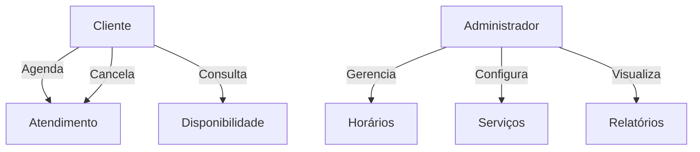

## 💈 Barberia API
## Projeto desenvolvido para o Bootcamp DecolaTech da Avanade 2025, em parceria com Dio.

API desenvolvida em Java com Spring Boot para o agendamento de atendimentos em uma barbearia. O projeto utiliza JPA com Hibernate para persistência no banco de dados PostgreSQL e gerencia as versões do banco com Flyway.

---

## 🚀 Tecnologias Utilizadas

- Java 17+
- Spring Boot
- Spring Data JPA
- PostgreSQL
- Flyway
- Gradle
- Docker (opcional)

---

## 📁 Estrutura do Projeto

```
barber-shop-api/
├── src/
│   ├── main/
│   │   ├── java/
│   │   └── resources/
│   │       ├── application.yml
│   │       └── db/migration/
├── .gitattributes
├── .gitignore
├── Dockerfile
├── README.md
├── build.gradle.kts
├── docker-compose.yml
├── gradlew
├── gradlew.bat
├── settings.gradle.kts
└── start-dev.sh
```

---

## 🧭 Diagrama de Casos de Uso



---

## ▶️ Como Executar o Projeto

### Pré-requisitos

- Java 17 ou superior
- PostgreSQL configurado
- Gradle instalado
- Docker e Docker Compose (opcional)

### Passos para execução

1. Clone este repositório:
   ```bash
   git clone https://github.com/digitalinnovationone/barber-shop-api.git
   ```

2. Acesse o diretório do projeto:
   ```bash
   cd barber-shop-api
   ```

3. Configure as variáveis de ambiente necessárias no arquivo `.env` (se necessário).

4. Execute o script de inicialização:
   ```bash
   ./start-dev.sh
   ```

   Este script executa os seguintes comandos:
   ```bash
   gradle clean
   gradle bootRun
   ```

5. Acesse a aplicação:
   ```
   http://localhost:8080
   ```

---

## 🤝 Contribuições

Contribuições são bem-vindas! Sinta-se à vontade para abrir uma *issue* ou enviar um *pull request* com melhorias.

---

## 📄 Licença

Este projeto está licenciado sob a [Licença MIT](https://opensource.org/licenses/MIT).
